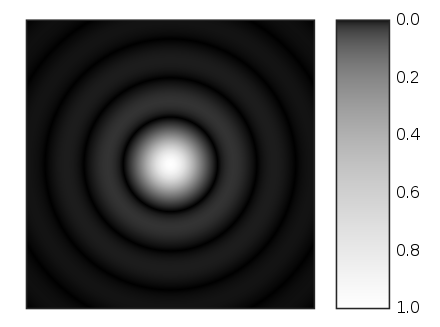

# 3D scope

This project aims to quantify the phototatic memory of *Chlamnydomonas Reinhardtii*, a unicellular green alga.  By tracking the cells' responses to light, we hope to compute a phototaxis index which describes how strongly the cells are moving towards the light.  This organism is of interest for producing biofuels and making hydrogen.

We wrote code to track cells in 30 fps videos and write the coordinates of their paths to an excel file.

Videos are analyzed frame by frame, and the positions of cells are compared to the positions in the previous frame.  If a cell is close enough to one cell in the previous frame, then we conclude that it must be the same cell in both frames.

Collision handling: when cells get too close, the algorithm stops tracking the cells until they move apart.  Then, they are tracked as new cells.

main.cpp is the latest version which automates many processes such as writing to an excel file.

To track cells in three dimensions, we use a 3D microscope and calculate the radii of the airy disks formed by diffraction patterns.

All of the code can be found [here](https://www.dropbox.com/sh/wuv22wedix1lpdb/AABHYAdSVm6h8VcDM4YXfU16a?dl=0).
